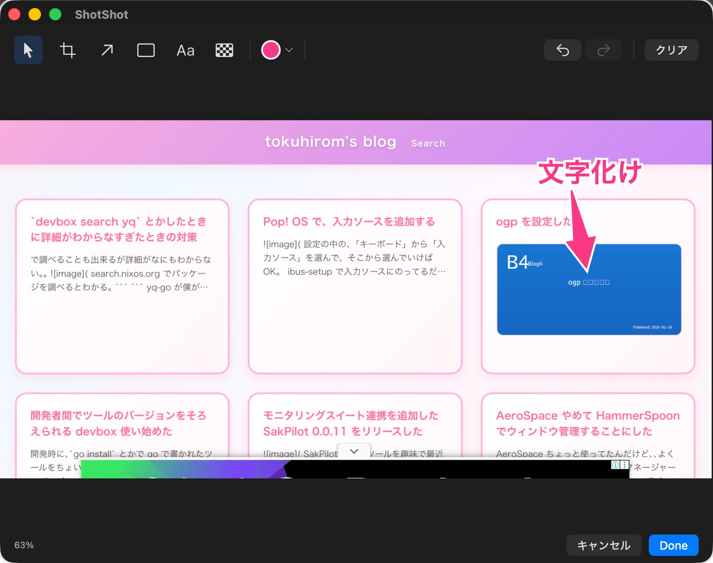

# ShotShot

macOS用のスクリーンショット & 注釈ツール。領域選択でキャプチャし、矢印・四角・テキスト・モザイクなどの注釈を追加できます。



## 機能

### キャプチャ
- **メニューバー常駐**: アプリはメニューバーに常駐（Dockには表示されない）
- **グローバルホットキー**: デフォルト `⌃⇧4` でキャプチャ開始（設定で変更可）
- **領域選択キャプチャ**: ScreenCaptureKit使用
- **Retina対応**: 高解像度ディスプレイに対応

### 注釈ツール
- **選択**: 注釈の選択・移動・リサイズ
- **切り抜き**: 画像の不要な部分を切り取り
- **矢印**: 色・太さ変更可、白い縁取り付き
- **四角**: 角丸/角張り切替可、色・太さ変更可
- **テキスト**: フォントサイズ・色変更可、白い縁取り付き
- **モザイク**: 選択領域をピクセル化

### 編集機能
- **Undo/Redo**: 操作の取り消し・やり直し
- **設定の記憶**: ツール・色・太さ・フォントサイズを次回起動時に復元

### 出力
- **画像保存**: PNG形式、デフォルト `~/Pictures/ShotShot/`
- **クリップボードコピー**: 保存時に自動コピー

## キーボードショートカット

| ショートカット | 機能 |
|---------------|------|
| ⌘Z | 取り消し (Undo) |
| ⇧⌘Z | やり直し (Redo) |
| ⌘S | 名前を付けて保存 |
| ⌘C | クリップボードにコピー |
| ⌘V | クリップボードから画像を開く |
| Delete | 選択中の注釈を削除 |

## 必要環境

- macOS 15.0+
- Xcode 16.0+
- Swift 6

## インストール

### ビルド

```bash
# デバッグビルド
./scripts/build.sh debug

# リリースビルド
./scripts/build.sh release
```

### 実行

```bash
# 最新のビルドを起動（なければ自動でビルド）
./scripts/run.sh
```

## 使い方

1. アプリを起動すると、メニューバーにカメラアイコンが表示される
2. `⌃⇧4` を押すか、メニューから「スクリーンショットを撮る」を選択
3. マウスでキャプチャしたい領域をドラッグして選択
4. エディタウィンドウが開き、注釈を追加
5. 「Done」で画像を保存してクリップボードにコピー

### クリップボードから画像を開く

エディタウィンドウがアクティブな状態で `⌘V` を押すと、クリップボード内の画像を新しいウィンドウで開けます。

### 設定

メニューから「設定」を選択すると、以下を設定できます:
- 画像の保存先
- グローバルホットキー

## 権限

このアプリは以下の権限を必要とします:

- **画面収録**: スクリーンショットを撮影するため

初回起動時にシステム設定での許可が必要です。

## ライセンス

MIT License
